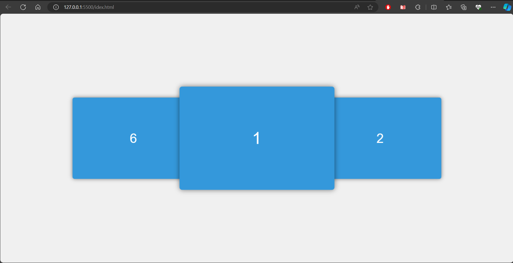

# Carrusel 3D

Este es un sencillo proyecto de carrusel 3D creado con HTML, CSS y JavaScript. El carrusel permite la interacción del usuario mediante clics y arrastres, proporcionando una experiencia visual atractiva. Puedes ver el carrusel en acción [aquí](#).

## Capturas de Pantalla



## Características

- **Interactividad:** El usuario puede interactuar con el carrusel mediante clics y arrastres.
- **Efecto 3D:** Los elementos del carrusel tienen un efecto de rotación tridimensional para una apariencia más atractiva.
- **Responsive:** El diseño es receptivo, adaptándose a diferentes tamaños de pantalla.

## Cómo Usar

1. Clona este repositorio:

   ```bash
   git clone https://github.com/tu-usuario/carrusel-3d.git
   ```

2. Abre el archivo `index.html` en tu navegador.

## Personalización

Puedes personalizar el contenido del carrusel modificando el archivo `index.html` y los estilos en `style.css`. Además, ajusta el comportamiento del carrusel en el archivo `main.js` según tus necesidades.

## Contribuciones

Siéntete libre de contribuir al proyecto. ¡Esperamos tus sugerencias y mejoras!

## Reconocimientos

Si encuentras útil este código en tu proyecto, agradeceríamos que incluyeras una mención al autor y un enlace a este repositorio.

---

*Hecho con ❤️ por [GeorgeCT19]*